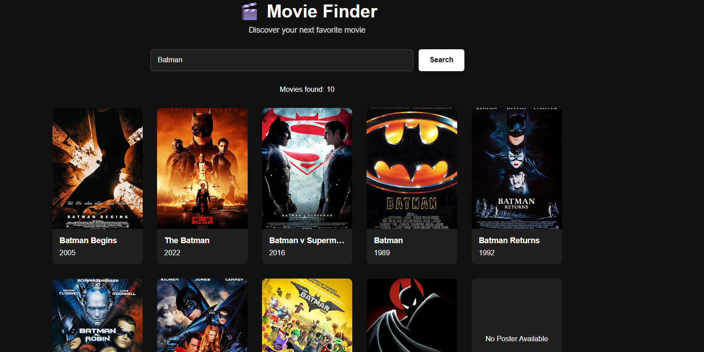
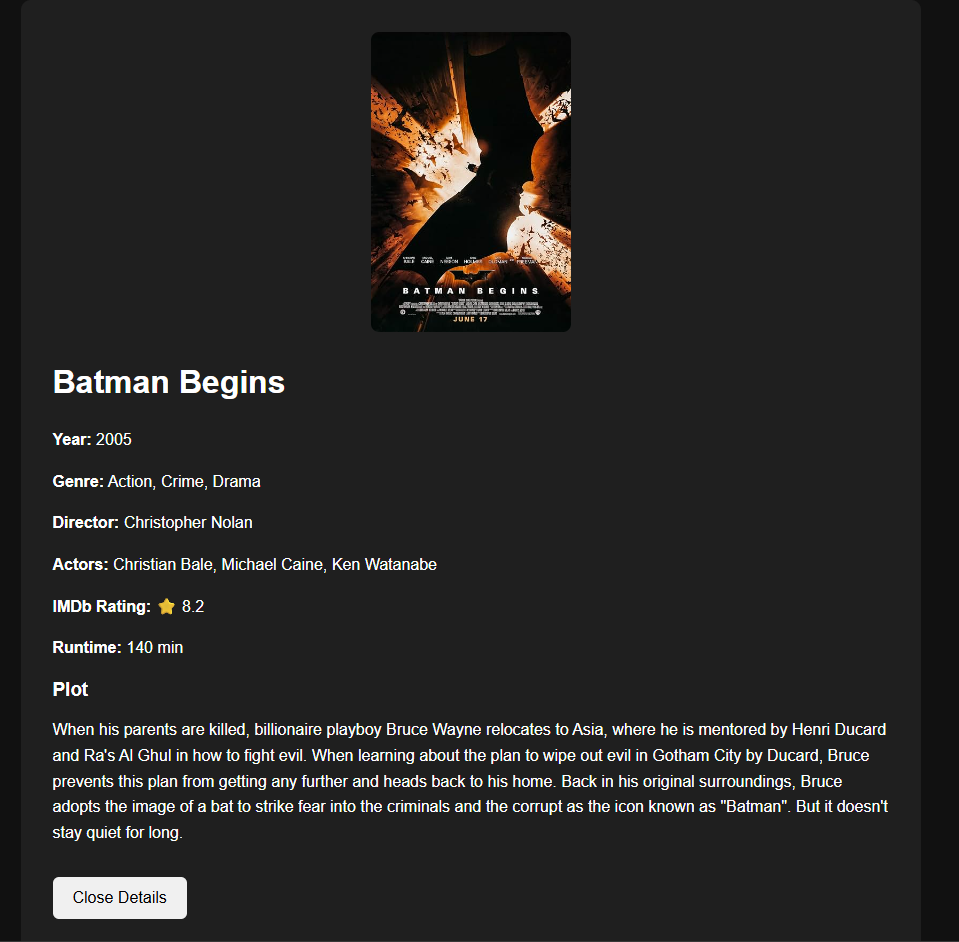

# 🎬 React Movie Finder

[](https://react-movie-app-two-flame.vercel.app/)

<table>
  <tr>
    <td></td>
    <td></td>
  </tr>
</table>

A responsive movie search application built with React and the OMDb API.

## Features

- Search for movies
- View movie search results
- View IMDb ratings
- View actors and directors
- View full movie plots
- Handles missing or broken movie posters
- Loading states
- Error handling
- Responsive design
- Search using the Enter key
- Close movie details
- Reusable React components

## Technologies

- React
- JavaScript
- CSS
- Vite
- OMDb API

## What I Learned

This project helped me practice:

- React components
- React state with `useState`
- Props
- Conditional rendering
- Event handling
- Forms
- API requests with `fetch`
- Async/await
- Environment variables
- Responsive CSS
- Error handling
- Reusable components
- Git and GitHub

## Getting Started

Install the dependencies:

```bash
npm install
```

Create a `.env` file in the project root:

```text
VITE_OMDB_API_KEY=your_api_key_here
```

Then start the development server:

```bash
npm run dev
```

### Important

The `your_api_key_here` text is only an example.

**Do not put your actual API key in the README.**

Your actual API key should remain in your local `.env` file, which is excluded by `.gitignore`.

## API

Movie information is provided by the OMDb API.

## Author

Kiran Persaud
